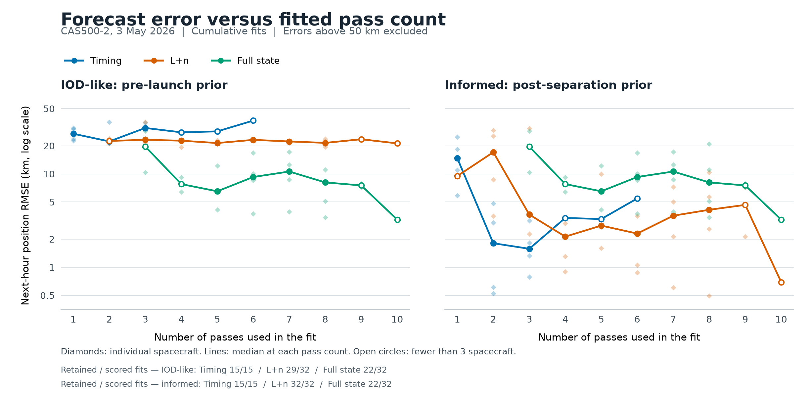
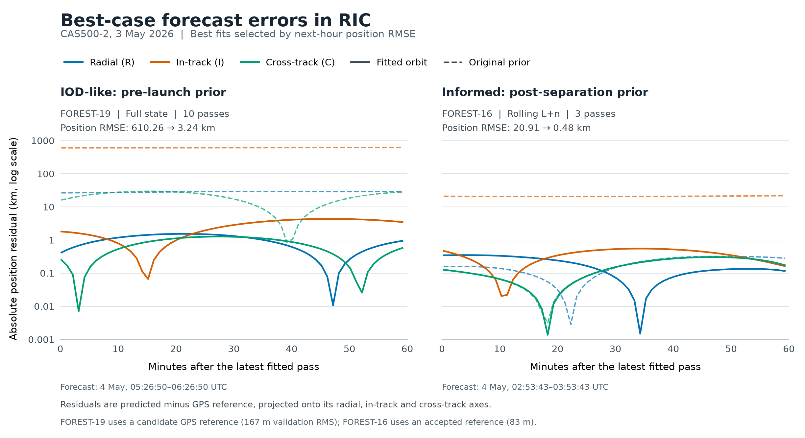
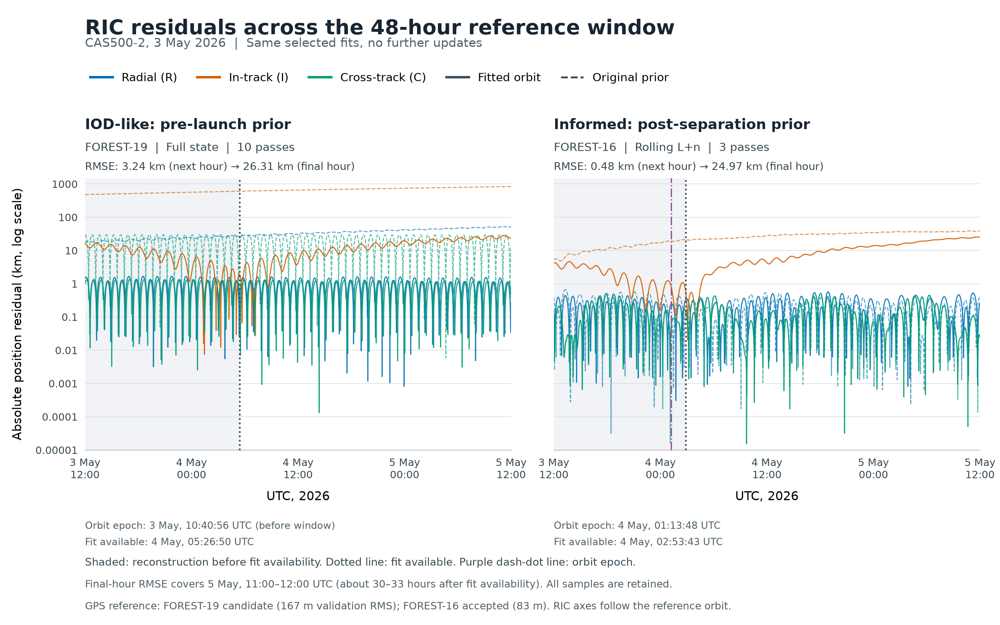

# Passive-Doppler orbit estimation: CAS500-2, 3 May 2026

## Purpose and scenarios

This study evaluates orbit estimation from passive reception of spacecraft
carrier signals during the CAS500-2 campaign. It covers four low-Earth-orbit
spacecraft, FOREST-16–19, during 3–4 May 2026, using one-way Doppler observations
and two initial-orbit scenarios.

The **pre-launch scenario** represents initial orbit determination (IOD) assisted
by an approximate orbit. Its large initial errors resemble the recovery problem
posed by a stale TLE, potentially weeks old in an operational setting. The
experimental TLEs were submitted two days before separation; the analogy concerns
prior quality. The **post-separation update scenario** starts from a substantially
better orbit and evaluates refinement during early operations. At the cumulative
fit checkpoints, median initial position errors were approximately 549 km and
9 km, respectively.

## Observation model

The observable is the carrier-frequency shift caused by spacecraft motion
relative to a ground receiver. For observation $i$ in pass $p(i)$,

$$
\widehat d_i=-\frac{f_c}{c}
\frac{(r_i-r_{g,i})^{\mathsf T}(v_i-v_{g,i})}
     {\|r_i-r_{g,i}\|}+b_{p(i)}.
$$

Here $r_i,v_i$ and $r_{g,i},v_{g,i}$ are spacecraft and receiver position and
velocity in a common Earth-centred inertial frame at the observation time.
Receiver motion includes Earth rotation. The carrier frequency is
$f_c=2.2163$ GHz, $c$ is the speed of light, and Doppler $\widehat d_i$ and
pass bias $b_p$ are in hertz. Each pass has an estimated constant bias to absorb
approximately constant frequency offsets. The changing Doppler curve constrains
orbital motion, while the bias accommodates its offset.

## Estimation methods

**Timing correction** estimates one adjustment to the TLE epoch, shared across
the selected passes. Observation and receiver times remain fixed. This changes
the spacecraft's progression along its SGP4-predicted orbit and is useful when
the dominant error is orbital timing.

**SGP4 mean-element correction** estimates changes in mean longitude $L$ and
mean motion $n$. Mean longitude specifies orbital phase; mean motion controls
its evolution. SGP4 propagates the corrected TLE using its standard perturbation
model. This two-parameter correction, denoted **L+n**, retains the prior's orbit
shape and plane. Before fitting, the TLE is represented at an epoch near the
observations while preserving its predicted trajectory.

**Cartesian full-state estimation** adjusts all three position and three
velocity components at a reference epoch. Numerical propagation uses Earth
gravity through degree and order four, Sun and Moon attraction, tides, and
relativistic corrections. Atmospheric drag is omitted because this configuration
has no supplied spacecraft drag properties. The additional state freedom allows
correction of orbit shape and plane, but requires more observational information
to constrain the solution.

All methods jointly estimate their orbit parameters and one bias per pass using
bounded robust least squares, implemented with SciPy's `least_squares`. With
$\epsilon_i(\theta)=\widehat d_i(\theta)-d_i$, the soft-L1 objective can be written,
up to a constant multiplier, as

$$
\min_{\theta\in\mathcal B}
\sum_i\left[\sqrt{1+\left(\frac{\epsilon_i(\theta)}{s}\right)^2}-1\right],
\qquad s=700\ \mathrm{Hz}.
$$

The vector $\theta$ contains the estimated parameters, and $\mathcal B$ specifies
their allowed bounds. Large residuals receive less influence, helping tolerate
contaminated Doppler observations. The initial orbit supplies the starting point;
the objective contains measurement residuals only.

Timing is fitted to individual passes and cumulatively. L+n uses either the
latest three eligible passes or all completed eligible passes; full-state fitting
is cumulative. Each fit starts from the scenario's fixed initial orbit. Repeated
updates therefore measure the benefit of newly available observations. Orbit fits
use carrier-lock and signal-quality screening; timing uses elevation and sample
count screening, producing a smaller contact set.

## Evaluation

Each solution is forecast over the hour immediately following its latest input
pass. Position accuracy is measured against a trajectory fitted independently to
GPS observations:

$$
E_r=\sqrt{\frac{1}{K}\sum_{k=1}^{K}
\|r_{\mathrm{fit}}(t_k)-r_{\mathrm{GPS}}(t_k)\|^2}.
$$

This position-vector RMSE is reported in kilometres. Initial and fitted orbits
are evaluated at identical timestamps, strictly after the fitting observations.
The forecast starts at pass completion, assuming immediate solution availability.

The reference trajectory estimates Cartesian state and effective drag from GPS
positions. Withholding ten minutes of each hour gives validation errors of
35–83 m for FOREST-16–18. FOREST-19 has a 167 m validation error, exceeding the
100 m acceptance threshold, and remains a candidate reference. This distinction
matters most when interpreting the smallest orbit errors.

Of 254 fits, 242 have complete reference coverage for the forecast hour. Twelve
early forecasts lack that coverage and are excluded from accuracy statistics.
Timing and L+n fits also undergo a quality screen requiring sufficient samples,
convergence, inactive parameter bounds, and full-rank, adequately conditioned
measurement sensitivities. Full-state fits are reported without this screen.

## Results and interpretation

The table reports median next-hour position RMSE. “All scored” includes fits
rejected by the quality screen; the accepted subset is labelled separately.

| Initial orbit | Cumulative method and population | Fits | Median RMSE |
| --- | --- | ---: | ---: |
| Pre-launch | Full state, all scored | 32 | 11.7 km |
| Pre-launch | Full state, at least six passes | 15 | 8.5 km |
| Pre-launch | L+n, all scored | 32 | 22.7 km |
| Post-separation update | L+n, all scored | 32 | 3.5 km |
| Post-separation update | L+n, quality-accepted | 25 | 2.7 km |

The figure shows cumulative fits, with errors above 50 km removed before
calculating each median. The table retains its original populations. Single-pass
timing and rolling L+n use fixed counts of one and three passes, respectively.
[Vector figure for export](figures/forest-pass-count-error.svg).

**IOD-like recovery reaches an approximately 10 km accuracy scale** with
full-state estimation in these cases. Early fits can have errors of thousands
of kilometres: short Doppler arcs can leave combinations of position, velocity,
and frequency bias weakly constrained. By **six–eight passes**, full-state median
error settles around **8–11 km**, with all four spacecraft below the cutoff.
Earlier filtered medians represent fewer spacecraft. L+n levels off near
**21–23 km after three–four passes**: its two orbit parameters preserve the
prior's shape and plane. It improves every scored pre-launch prior.

**A useful prior enables approximately 3 km refinement.** Cumulative L+n improves
the updated prior in 26 of 32 scored fits. Its main improvement occurs by
**three–four passes**, followed by median errors around **2–4 km through eight
passes**. Retaining prior geometry reduces the number of unknowns that Doppler
must determine. The accepted-fit 90th percentile is 8.8 km, showing the spread
around the 2.7 km median.

Cumulative timing reaches median errors of **1.6–1.8 km after two–three passes**
with informed priors, compared with roughly 22–31 km for the IOD-like case.
Later timing points represent FOREST-18 alone. Likewise, only two spacecraft
reach nine orbit-model passes and one reaches ten; those final points describe
the remaining spacecraft rather than a plateau across all four.

**Repeated updates achieve sub-kilometre accuracy in favourable cases.**
FOREST-16 reaches 0.50 km with eight cumulative passes; FOREST-18 reaches 0.90 km
with four. Both spacecraft have accepted GPS references. Accuracy varies with
pass geometry and data quality; overlapping forecasts and shared observations
make successive fits correlated.

The best-case examples are selected by lowest next-hour position RMSE: the
pre-launch full-state fit reaches **3.24 km** for FOREST-19 with ten passes;
the informed-prior L+n fit reaches **0.48 km** for FOREST-16 using the latest
three passes. The latter is selected across both rolling and cumulative fits.
FOREST-19 retains its candidate-reference designation because its GPS validation
error exceeds the acceptance threshold.

Residuals are projected onto the GPS reference orbit's radial, in-track and
cross-track (RIC) axes. The figure shows absolute component errors on a log
scale; sharp dips occur near component zero crossings. Dashed curves show the
original prior and solid curves the fitted orbit. Full-state fitting reduces
errors in all three directions. L+n mainly corrects in-track error, reducing
its RMS from **20.9 km to 0.39 km**, while radial and cross-track RMS remain
around **0.2 km**. [Vector figure for export](figures/forest-best-case-ric.svg).

Extending the same fixed solutions across **3 May, 12:00 UTC to 5 May, 12:00 UTC**
reveals substantial error growth. In the final hour, the IOD-like fit reaches
**26.3 km** position RMSE and L+n reaches **25.0 km**, approximately 30–33 hours
after fit availability. The growth is mainly in-track, consistent with
accumulating orbital-phase error beyond the fitted observations. Radial and
cross-track errors remain predominantly periodic.

The shaded interval precedes fit availability and shows retrospective
reconstruction; the remaining interval shows prediction with fixed parameters.
Orbit epochs are identified separately. These are the same cases selected for
their next-hour accuracy, carried through the complete reference window without
further updates. The contrast shows why the sub-kilometre result is tied to its
forecast horizon. [Vector figure for export](figures/forest-best-case-ric-48h.svg).

References: [SGP4 methodology](https://celestrak.org/publications/AIAA/2006-6753/),
[full experiment results](../raw_results/forest-experiment-v5/README.md), and
[full-precision fit results](../raw_results/forest-experiment-v5/fits.csv).
