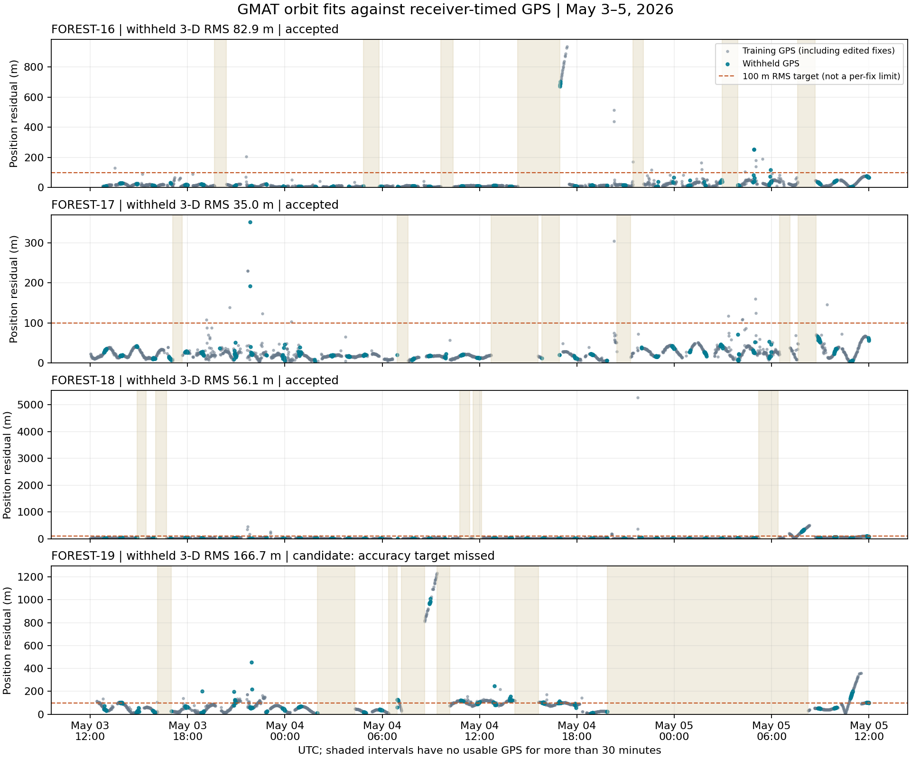

# GMAT GPS orbit fits — May 4, 2026

Four CCSDS OEM 1.0 KVN files cover **2026-05-03 12:00:00 through 2026-05-05 12:00:00 UTC**.
Each contains **2,881 Earth-centered EME2000 states**, sampled every 60 seconds in km and km/s.

| Satellite | Withheld GPS 3-D RMS | Status | OEM |
|---|---:|---|---|
| FOREST-16 | 82.9 m | Accepted | [FOREST-16.oem](FOREST-16/FOREST-16.oem) |
| FOREST-17 | 35.0 m | Accepted | [FOREST-17.oem](FOREST-17/FOREST-17.oem) |
| FOREST-18 | 56.1 m | Accepted | [FOREST-18.oem](FOREST-18/FOREST-18.oem) |
| FOREST-19 | 166.7 m | **Candidate — target missed** | [FOREST-19.candidate.oem](FOREST-19/FOREST-19.candidate.oem) |

The 100 m RMS criterion is assessed on every screened GPS observation in each hour's final ten minutes.
Those observations were withheld from the validation fit; validation residuals were not clipped.
Accepted OEMs then use a new fit to all accepted GPS observations.
FOREST-19 is the validation-fit candidate, not an accepted 100 m product; its final all-observation fit was not run.
A concentrated interval on May 4 around 09:00 UTC has roughly 1 km GPS/model disagreement.
Resolving the source of that disagreement requires further GPS-quality investigation.



The plot shows validation-fit residuals, including observations edited out by GMAT. Shading identifies gaps over 30 minutes.
Error inside gaps or before/after observations is **unverified**. FOREST-19's screened observations have a longest gap
of about 12.4 hours. The accuracy figures are residuals against withheld GPS, not guarantees of absolute orbit accuracy.

## Reproduction

From the repository root:

```bash
uv run python scripts/smooth_gps.py run --output-dir artifacts/gps_smoothing/reproduction
uv run python scripts/smooth_gps.py validate --satellites 16 17 18 \
  --output-dir artifacts/gps_smoothing/reproduction
```

The complete run deliberately returns status 1 because FOREST-19 misses the quality target.
Use a different output directory for a fresh run. Per-satellite manifests record inputs and runtime data checksums.
Generated GMAT scripts use absolute paths from this workspace; regenerate them with the runner when moving the project.
See [the GMAT workflow](../../../scripts/gmat/README.md) for installation, assumptions, and recovery instructions.

Model: JGM3 20x20 gravity, Sun/Moon gravity, Jacchia–Roberts drag with observed space weather,
Runge–Kutta 8/9 at 30-second steps; Cartesian state and effective CdA/m estimated per satellite.
Receiver GPS epochs replace packet arrival time. No maneuvers or SRP are modeled.
GMAT's native production writer generates OEM 1.0; its experimental OEM 2.0 writer is not enabled.

## Interruption diagnosis and fixes

The available system journal records WSL shutdown/power-off on September 7 around 21:00 CEST and restart
around 21:17 CEST. No GMAT segmentation fault or out-of-memory kill was recorded. The logs do not establish
what triggered the original interruption; all four fitted states and complete estimator reports survived.

During recovery, repeated propagation commands were found to stall during export. Export now uses one continuous
propagation and dense state reporting, completing in about two seconds. Estimation and export have separate
checkpoints. Fixed report-header handling and explicit interpolation margins ensure complete OEM endpoints.

## Snapshot contents and provenance

This is a frozen results snapshot, not a resumable GMAT working directory.
Each satellite includes its delivered OEM (or candidate), quality report,
manifest, screened observations, rejection reasons, and per-stage fitted state,
quality report, and residual CSV. The full estimator iteration logs, direct
integrator reports, and generated scripts remain in the ignored working directory;
the runner regenerates them for a fresh run. The native GMAT template is tracked
in [scripts/gmat](../../../scripts/gmat/).

OEMs, observation arrays, residual CSVs, and fitted-state reports are preserved
byte for byte. Quality-report product paths are relative to the satellite folder;
runtime paths in manifests are relative to the repository root. Source CSV hashes
refer to `gps-examples/`. No external runtime files are included. Hashes in the
original manifests and reports still identify the original inputs and products;
`SHA256SUMS` covers every included snapshot file except itself.

Reproduction uses the same model and settings, but exact numerical reproduction
requires the runtime/data hashes listed in each manifest. Upstream space-weather
and Earth-orientation downloads change over time; a current download need not
match this frozen run. OEM creation dates also change on re-export.

The GPS implementation was preserved in commit `c2e9244` before integrating
remote main at `ba5e584`. See [integration checks](integration.md) for the checks
performed after that merge. No covariance is supplied, and local FOREST names
serve as OBJECT_ID because authoritative COSPAR identifiers were not provided.

To verify the archive without GMAT:

```bash
(cd reports/forest-gps/20260504 && sha256sum -c SHA256SUMS)
uv run pytest tests/test_gps_snapshot.py -q
```
